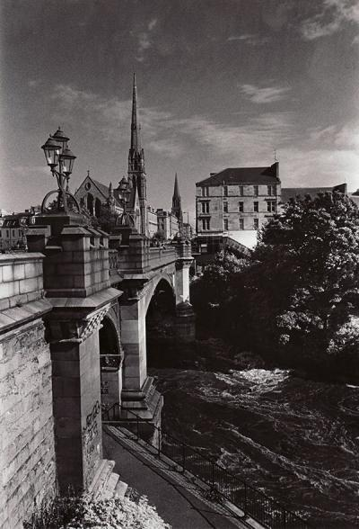

I am based in the West End of my adopted City of Glasgow.

Like most accountancy / data types I spend most of my professional life in Excel and VBA.

I do have an interest in more modern tools like 'R' and you might see me at tech meetups and the like.

(I'm currently working on trying to get Outh2 client credentials flow working in VBA)

I did my Postgraaduate work in Instrumentation, where I spectaculary failed to get thin film anemometry to work in my wind tunnel experiments.

I have a degree in Paper Science from back in the days when UMIST was still around and offering weird degrees to industrial types.
